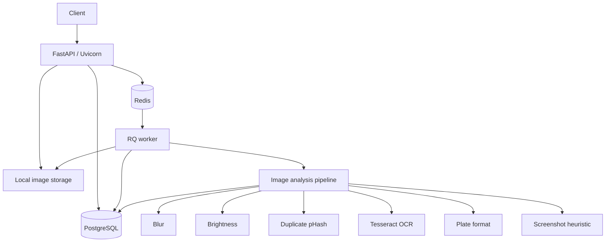

# Intelligent Media Processing Pipeline

Backend system that accepts vehicle images, processes them asynchronously, and returns structured heuristic analysis. Built as a Backend + AI Engineering take-home: the goal is engineering judgment, not production-grade ML accuracy.

Upload never waits for analysis. The API validates the file, stores it, writes a `pending` row, enqueues a Redis Queue (RQ) job, and returns `202 Accepted` with a processing ID. A separate worker process runs blur, brightness, duplicate, OCR, Indian plate-format, and lightweight screenshot heuristics, then persists results.

---

## Project Overview

Field-uploaded vehicle photos can be unusable: blurry, too dark, duplicated, a screenshot, or carrying OCR text that does not look like an Indian registration number. This service:

1. Accepts an image over HTTP
2. Issues a UUID processing ID
3. Stores the file locally and metadata in PostgreSQL
4. Analyzes the image in a background worker
5. Exposes status and results APIs, including a human-readable failure reason when processing cannot complete

Heuristics communicate uncertainty (`detected`, `score`, `confidence`, `reason`). Confidence values are **not** calibrated ML probabilities.

---

## Architecture



| Piece | Role |
| --- | --- |
| FastAPI | Versioned HTTP API (`/api/v1`), validation, OpenAPI |
| PostgreSQL | Image metadata + JSONB analysis results |
| Local storage | Original uploaded bytes (`STORAGE_PATH`) |
| Redis + RQ | Job queue between API process and worker process |
| Worker | Status transitions, analyzers, result persistence |

API and worker share the same image and code; they are **separate processes** with different commands.

---

## Processing Flow

```text
Upload
  → Validate (exists, size, decodable, allowed type)
  → UUID processing ID
  → Store file + metadata (status = pending)
  → Enqueue RQ job
  → Return 202 immediately
       ↓
Worker
  → pending → processing
  → Load stored image
  → Run analyzers (OCR failures are isolated)
  → Persist structured results
  → processing → completed
       or
  → processing → failed + failure_reason
       ↓
Client polls status / fetches results
```

---

## Queue Strategy

Redis + RQ was selected because:

- The assignment stack specifies it
- It keeps the API process free of analysis CPU/OCR work
- Retry is available without a second message bus
- Operational model is easy to explain: one queue name (`image_jobs`), one worker command

It is not Kafka, Celery, or a custom broker. For this assignment that is a feature: fewer moving parts, same async split.

---

## Major Design Decisions

- **Processing ID = `images.id`.** One UUID, no extra lookup column.
- **JSON/JSONB analyzer payloads.** Analyzer shapes can evolve without a migration per field. Indexed columns remain `status`, `perceptual_hash`, and timestamps.
- **String UUIDs.** Same SQLAlchemy models work in PostgreSQL (runtime) and SQLite (tests).
- **Analyzers return dicts and are independently testable.** The worker catches per-analyzer exceptions so optional OCR cannot fail blur/brightness/duplicate.
- **Queue failure rolls back the upload.** If Redis is down, the file and row are removed and the client gets `503` rather than a `pending` ID that will never run.
- **No paid external AI APIs.** Tesseract + OpenCV + Pillow + imagehash run locally.

---

## Image Analysis

All thresholds live in environment variables / `app/core/config.py`.

### 1. Blur

Variance of the Laplacian (OpenCV). Default `BLUR_THRESHOLD=100`.

That default is a common OpenCV starting point, not a universal constant. Phone cameras, compression, and subject distance all move the score.

- Below threshold → `detected: true` (possibly blurry)
- `confidence` is distance-from-threshold, capped, documented as heuristic

### 2. Brightness / low-light

Mean grayscale value in `[0, 255]`. Default `BRIGHTNESS_THRESHOLD=50`.

This is a global metric: it can miss a dark plate on a bright background and can flag usable night photos.

### 3. Duplicate

64-bit perceptual hash (`imagehash.phash`). Hamming distance vs previously stored hashes. Default `DUPLICATE_HASH_DISTANCE=5`.

Filenames are never compared. Exact match is distance `0`. This take-home scans stored hashes (fine for a small dataset). Production needs ANN / bit-distance indexes; see Scalability.

Two concurrent uploads of the same photo can miss each other if both hash before either commit. Acceptable here; documented.

### 4. OCR

Tesseract via pytesseract. Empty text or a missing binary does **not** fail the job.

- `status`: `completed` | `unavailable` | `failed`
- `ocr_text` is `null` when nothing readable was found
- Results are never fabricated

### 5. Indian vehicle number format

Regex against normalized OCR text (`KA01AB1234`, `MH12CD5678`, `DL01AA1234`, Bharat series `22BH1234AA`).

`format_valid` means **the text resembles a pattern**. It does not prove the plate is genuine, issued, or correctly read. Diplomatic, armed-forces, and some special series are not covered. OCR confusions (`O`/`0`) are not auto-corrected.

### 6. Screenshot / editing heuristic (optional, conservative)

EXIF `Software`, missing camera tags, and common screen resolutions. Language is “potentially suspicious”, not forensic certainty. Missing EXIF is also normal after messaging-app recompression.

---

## Uncertainty

Every check exposes some of: `detected` / `issue`, `score`, `confidence`, `reason`.

`confidence` is a convenient `0–1` heuristic so clients can sort or display caution. It is **not** a scientifically calibrated probability. See `confidence_note` on analyzer payloads.

---

## Database Design

### `images`

| Column | Purpose |
| --- | --- |
| `id` | UUID processing ID (PK) |
| `original_filename` | Client filename (untrusted) |
| `stored_filename` / `storage_path` | Local file |
| `mime_type`, `file_size`, `width`, `height` | From decoded bytes, not the extension |
| `perceptual_hash` | pHash hex, indexed |
| `status` | `pending` \| `processing` \| `completed` \| `failed` |
| `failure_reason` | Human-readable, set on failure |
| `created_at`, `updated_at` | Indexed where useful |

### `analysis_results`

One-to-one with `images` (`image_id` unique FK, `ON DELETE CASCADE`). JSONB columns: blur, brightness, duplicate, OCR, vehicle number, screenshot.

Alembic migration: `alembic/versions/001_initial_schema.py`. Tables are not created ad hoc in application startup for PostgreSQL.

---

## Error Handling

| Situation | HTTP | Notes |
| --- | --- | --- |
| Missing file / empty upload | 400 | `missing_file` |
| Corrupt / undecodable bytes | 400 | `corrupt_image` |
| Oversize | 413 | Checked while reading chunks |
| Unsupported type (e.g. GIF) | 415 | Decoded first; extension is not trusted |
| Unknown processing ID | 404 | |
| Results not ready | 202 | `pending` / `processing` |
| Failed job | 200 on results/status | Includes `failure_reason` |
| Database down on upload | 503 | File cleaned up |
| Redis down on enqueue | 503 | File + row cleaned up |
| OCR unavailable | Job still completes | OCR `status=unavailable` |

Python stack traces are logged, never returned in JSON.

---

## Retry Strategy

RQ `Retry(max=JOB_RETRY_MAX, interval=[10, 30])` (default max 2).

| Class | Behavior |
| --- | --- |
| Invalid / missing / undecodable image | Mark `failed`, do **not** re-raise. RQ will not retry endlessly. |
| Connection / timeout style errors | Mark `failed` for visibility, re-raise so RQ can retry. A later success overwrites status to `completed`. |

Trade-off: a retried job can briefly show `failed` then `completed`. Alternative (only fail after retries are exhausted) needs RQ failure callbacks and more moving parts. Not worth it for this assignment.

RQ job *success* is not the same as image `completed`. A non-retryable image failure is persisted on the row; the RQ job returns normally so it is not requeued.

---

## Running Locally

Requirements: Python 3.11+, PostgreSQL, Redis, Tesseract OCR (for real plate text). Tests do not need PostgreSQL, Redis, or Tesseract.

```bash
python -m venv .venv
# Windows: .\.venv\Scripts\Activate.ps1
# Unix:    source .venv/bin/activate
pip install -r requirements.txt
cp .env.example .env
# Edit DATABASE_URL and REDIS_URL if needed
```

Install Tesseract and ensure `tesseract` is on `PATH` (Windows: [UB-Mannheim installer](https://github.com/UB-Mannheim/tesseract/wiki)).

```bash
python scripts/wait_for_db.py
alembic upgrade head
uvicorn app.main:app --reload --host 0.0.0.0 --port 8000
```

In a second terminal:

```bash
rq worker image_jobs --url redis://localhost:6379/0
```

Set `PYTHONPATH` to the project root if the worker cannot import `app`.

---

## Docker

```bash
docker compose up --build
```

Services: `api` (port 8000), `worker`, `postgres` (5432), `redis` (6379). API and worker use the same image, different commands. A named volume shares `storage/original` so the worker can read files the API wrote. Both run `alembic upgrade head` after waiting for Postgres.

Interactive docs: http://localhost:8000/docs

---

## API Documentation

OpenAPI/Swagger is served at `/docs` and `/redoc`. Schemas are Pydantic models.

### `GET /api/v1/health`

```json
{ "status": "ok" }
```

### `POST /api/v1/images`

`multipart/form-data` field `image`. Returns `202 Accepted`.

```bash
curl -X POST \
  -F "image=@vehicle.jpg" \
  http://localhost:8000/api/v1/images
```

```json
{
  "processing_id": "uuid",
  "status": "pending",
  "message": "Image accepted for processing"
}
```

### `GET /api/v1/images/{processing_id}/status`

```bash
curl http://localhost:8000/api/v1/images/<processing_id>/status
```

```json
{ "processing_id": "uuid", "status": "pending" }
```

On failure:

```json
{
  "processing_id": "uuid",
  "status": "failed",
  "failure_reason": "Stored image file is missing on disk"
}
```

### `GET /api/v1/images/{processing_id}/results`

```bash
curl http://localhost:8000/api/v1/images/<processing_id>/results
```

Completed (shape abbreviated):

```json
{
  "processing_id": "uuid",
  "status": "completed",
  "analysis": {
    "image_quality": {
      "blur": { "detected": false, "score": 182.4, "confidence": 0.91, "reason": "..." },
      "brightness": { "issue": false, "average_brightness": 128.4, "confidence": 0.93, "reason": "..." }
    },
    "duplicate": { "detected": false, "matched_image_id": null, "similarity": 0.12 },
    "ocr": { "status": "completed", "ocr_text": "KA01AB1234", "confidence": 0.82 },
    "vehicle_number": { "ocr_text": "KA01AB1234", "format_valid": true, "confidence": 0.8 },
    "screenshot": { "detected": false, "reason": "..." }
  }
}
```

If still `pending`/`processing`, HTTP `202` with `analysis: null`. The numbers above are **illustrative of schema**, not recorded sample-image output.

---

## Testing

```bash
pytest
```

Coverage includes health, upload validation, status/results, blur, brightness, duplicate pHash, plate regex, OCR isolation (mocked Tesseract), and worker success/failure. Tests use SQLite and mock RQ enqueue so they run without Docker.

---

## Assumptions

- Uploads are still images (JPEG, PNG, WEBP, BMP, TIFF), not video.
- One analysis row per image is enough.
- Local disk is acceptable for a take-home; API and worker share a filesystem (Compose volume).
- English Tesseract data is enough.
- Indian plate validation covers standard private/commercial and Bharat series only.
- A database scan of pHash values is acceptable at take-home scale.
- Health is liveness of the API process, not a dependency probe.

---

## Trade-offs

| Choice | Why | Cost |
| --- | --- | --- |
| Local filesystem | No cloud credentials; assignment runs offline | Not multi-host; lost if the container volume is wiped |
| Redis + RQ | Specified, simple, process isolation | Less tooling than Celery; no delayed routing beyond Retry |
| Heuristic analyzers | Assignment forbids pretending perfect ML | False positives/negatives; thresholds need tuning on real photos |
| Tesseract | Free, local | Weak on angled/dirty plates; often returns no text |
| pHash linear scan | Clear and testable | Will not scale to millions of images |
| JSONB results | Flexible analyzer output | Weaker column-level constraints |
| SQLite in tests | Fast, no Docker required for CI-style pytest | JSONB/Postgres-specific behavior is not exercised by pytest |

---

## Scalability

**Not implemented.** What would change in production:

- Object storage (S3/GCS) instead of local disk; DB stores object keys
- Multiple RQ workers; queue partitioning by priority if needed
- Postgres indexes already cover status/hash/time; add connection pooling (PgBouncer) under load
- Approximate nearest neighbor or `bit`/`pgvector` for pHash at large N
- Rate limiting and auth in front of upload
- Metrics (job duration, queue depth, analyzer error rate) and structured JSON logs to a collector
- Horizontal API replicas behind a load balancer; sticky storage replaced by object storage
- Dead-letter handling via RQ failure registry + alerting, not only `failure_reason`

---

## Future Improvements

- Tune blur/brightness thresholds on the company’s real sample images
- Plate localization (crop) before OCR
- AuthN/AuthZ and per-tenant quotas
- Replace linear pHash scan
- Object storage + CDN for originals
- Idempotent re-process endpoint for operators
- Dependency-aware `/health/ready` (Postgres + Redis)

Do not treat screenshot/tamper heuristics as a roadmap to forensics without dedicated models and a threat model.

---

## Sample Images

Put the company’s three provided vehicle images in `samples/`. Do not commit invented results.

```bash
curl -X POST -F "image=@samples/<filename>" http://localhost:8000/api/v1/images
curl http://localhost:8000/api/v1/images/<processing_id>/status
curl http://localhost:8000/api/v1/images/<processing_id>/results
```

Record real outputs only after those files are processed.

---

## AI Usage Disclosure

AI tools (Cursor) were used to implement this repository from the assignment specification.

| Area | How AI was used |
| --- | --- |
| Architecture | Followed the assignment’s API / Postgres / local storage / Redis / worker layout rather than inventing extra services |
| Boilerplate | FastAPI app, SQLAlchemy models, Alembic revision, Docker Compose, config/logging |
| Analyzers | OpenCV Laplacian blur, mean brightness, imagehash duplicates, pytesseract OCR, plate regex, conservative EXIF screenshot heuristic |
| Tests | pytest + TestClient cases for upload/status/worker/analyzers |
| Documentation | This README |
| Debugging / review | Unused schema removal, chunked upload size check, worker migration wait, exception logging |

**Where output needed modification**

- Windows PowerShell does not support `mkdir -p`; directory creation had to be corrected for this environment.
- API-only migrations could race the worker; Compose now waits for Postgres and runs `alembic upgrade head` on the worker as well.
- An unused `ImageMetadata` schema was removed during review.
- A catch-all FastAPI `Exception` handler was tightened so unexpected errors are logged and HTTP/validation exceptions are not swallowed.

**How the generated code was validated**

- `pytest`: **30 passed** on this machine (Python 3.14 venv, SQLite, RQ enqueue mocked, Tesseract not required).
- Docker Compose was **not** executed here: Docker is not installed, and nothing was listening on localhost `5432` / `6379`.
- Company sample images were **not** present; no sample-image scores are claimed.

Do not treat this section as evidence that the Dockerized stack was run end-to-end on the authoring machine. After Docker Desktop (or local Postgres + Redis + Tesseract) is available, run the commands in **Docker** / **Running Locally** and re-record any sample-image outputs.
